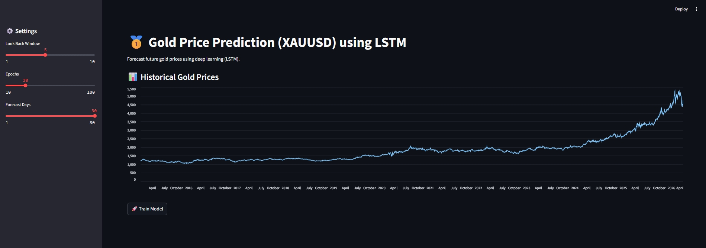
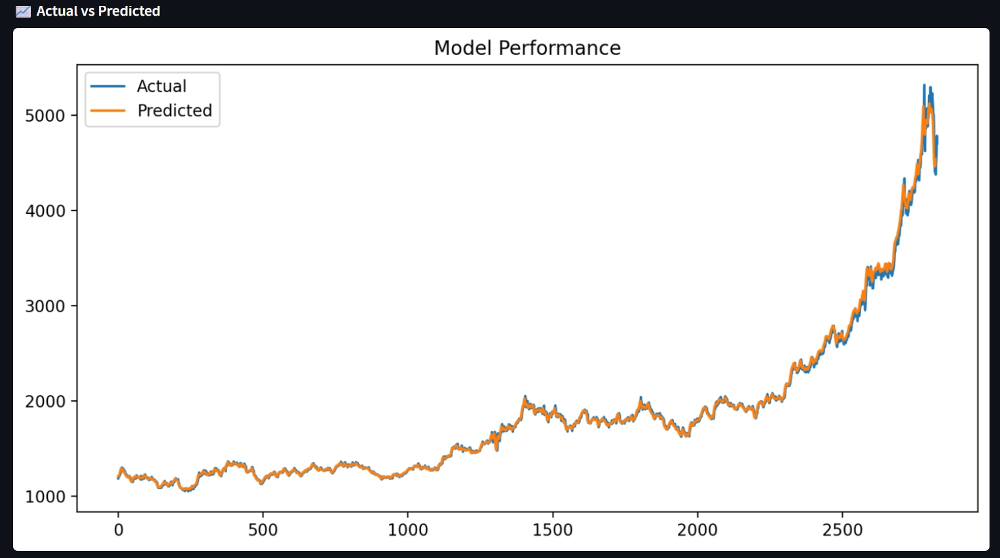
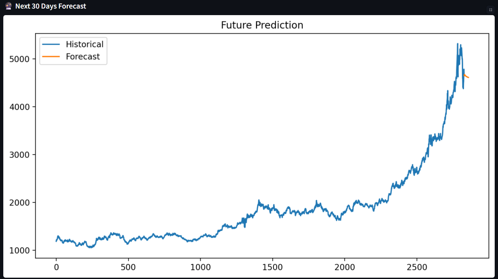

# 🥇 XAUUSD Gold Price Prediction using LSTM

## 🚀 Overview
This project predicts gold prices (XAUUSD) using an LSTM (Long Short-Term Memory) neural network.

The model learns patterns from historical time series data and forecasts future values. The predictions are visualized using a Streamlit web application.

---

## 🧠 How It Works
- Historical price data is fetched using Yahoo Finance  
- Data is normalized using MinMaxScaler  
- Time series is converted into sequences  
- LSTM model learns temporal patterns  
- Future values are predicted iteratively (next 30 days)  

---

## 🔥 Features
- Real-time gold price data  
- LSTM-based forecasting  
- Interactive Streamlit UI  
- 30-day future prediction  
- Visualization of actual vs predicted values  

---

## 🧠 Tech Stack
- Python  
- TensorFlow / Keras  
- Streamlit  
- yFinance  
- Scikit-learn  

---
## 📸 Output Screenshots

### 📊 Main Prediction Chart


### 📉 Model Performance


### 🔮 Next 30 Days Prediction


### 📋 Latest Data View


---
## ▶️ Run Locally

```bash
pip install -r requirements.txt
streamlit run app.py